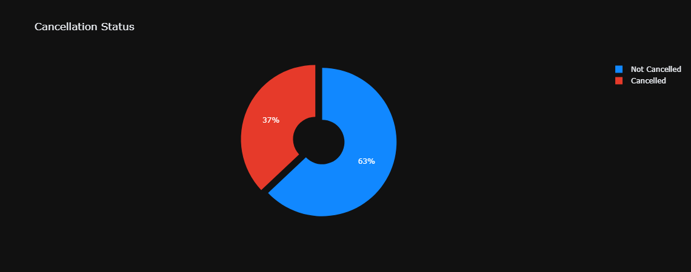
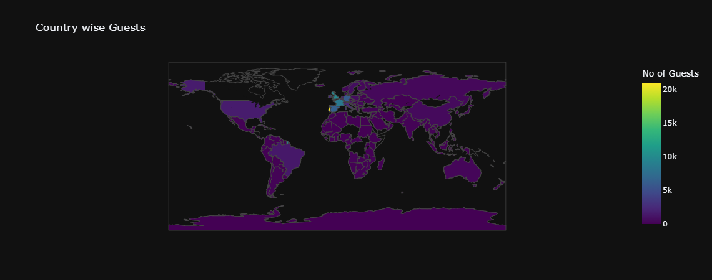
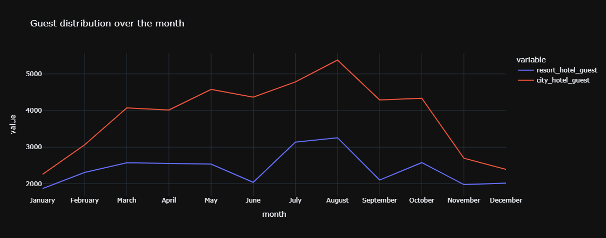
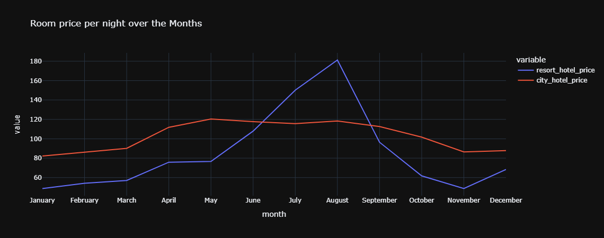
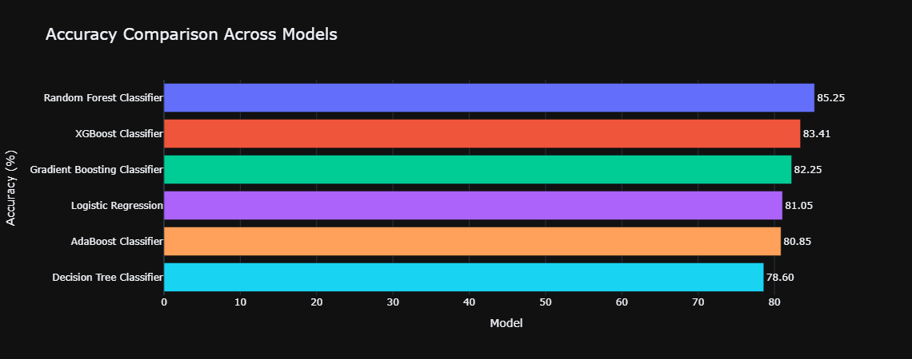
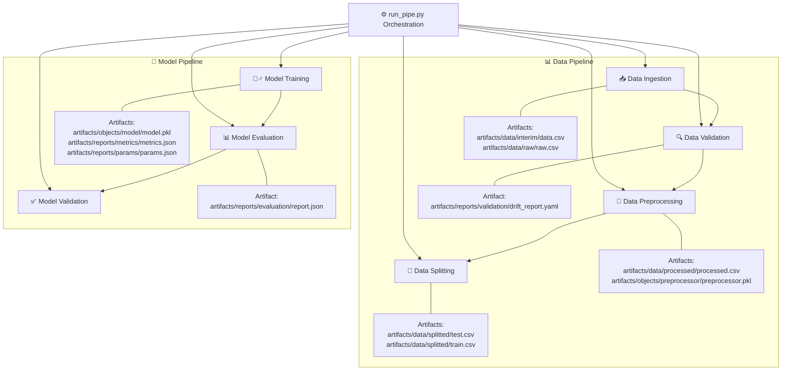
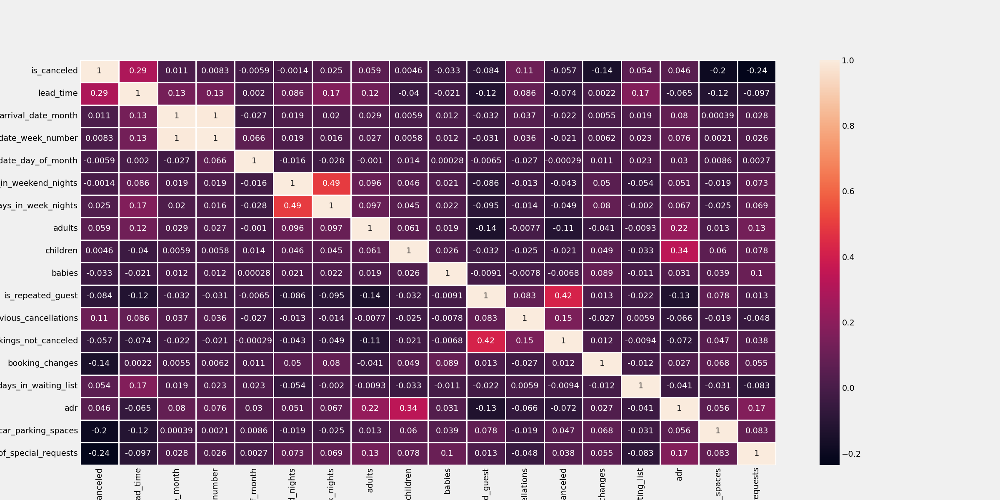

# 🏨 Hotel Booking Cancellation Prediction System 🌟  

<div align="center">
  <br>

*Empowering hotels to predict cancellations and optimize their operations!*
</div>

--- 

## 📖 **Overview**  
The **Hotel Booking Cancellation Prediction System** is an end-to-end machine learning solution designed to forecast whether a hotel booking will be canceled. This system helps hotels improve revenue management, streamline operations, and plan resources effectively. It uses historical booking data to train models that predict cancellations, and it comes with a robust, modular pipeline that covers every step from data ingestion to model deployment.

---

**❓ Problem Statement**  
<div align="center">
  
</div>

Hotels face significant challenges due to last-minute booking cancellations 🚫, leading to revenue loss and inefficient resource management. This system predicts whether a booking will be canceled, empowering hotels to optimize pricing 🏷️, staffing 👥, and inventory 📦.  

**✨ Solution**  
A **machine learning-powered pipeline** that:  
🔹 Processes historical booking data  
🔹 Detects patterns and predicts cancellations  
🔹 Generates actionable insights through easy-to-understand visuals  

---

## 🚀 **Key Features**  
- **Automated Data Pipelines** 📊: From raw data to predictions, fully automated!  
- **Smart Preprocessing** 🧹: Handles missing values, outliers, and data drift.  
- **Model Zoo** 🤖: Trains and compares 5+ ML models (Random Forest, XGBoost, etc.).  
- **Visual Reports** 📈: Interactive charts for decision-makers.  
- **One-Click Deployment** 🚢: Docker and Streamlit support.  

---

## 💡 Key Features

- **Data Ingestion & Validation**  
  📥 Automatically fetches and validates raw booking data from a MySQL database.
  
- **Data Preprocessing**  
  🔍 Cleans and transforms data (handles missing values, encoding, normalization) for accurate predictions.
  
- **Model Training & Evaluation**  
  🏋️‍♂️ Trains multiple models with hyperparameter tuning to select the best performer, and evaluates them using robust metrics.
  
- **Model Deployment**  
  🌐 Deploys the trained model via an interactive web application (using Flask/Streamlit) for real-time predictions.
  
- **MLOps Integration**  
  🔧 Implements versioning, monitoring (data drift, performance), and automated workflows for continuous improvement.
  
- **Interactive Notebooks**  
  📊 Jupyter notebooks document every stage of the pipeline with visualizations and detailed analyses.

---

## 🗂️ Project Structure

```plaintext

├── 📁 artifacts/                   # Auto-generated artifacts (ignored in Git)
│   ├── 📁 data/                    # Datasets
│   │   ├── 📁 interim/             # Interim data (e.g., data.csv)
│   │   ├── 📁 processed/           # Preprocessed data (e.g., processed.csv)
│   │   ├── 📁 raw/                 # Raw data (e.g., raw.csv)
│   │   └── 📁 splitted/            # Train, test splits (train.csv, test.csv)
│   ├── 📁 objects/                 # Saved objects & models
│   │   ├── 📁 model/               # Trained model (model.pkl)
│   │   └── 📁 preprocessor/        # Preprocessing object (preprocessor.pkl)
│   └── 📁 reports/                 # Evaluation, metrics, and drift reports
│       ├── 📁 evaluation/          # Model evaluation reports (report.json)
│       ├── 📁 metrics/             # Metrics files (metrics.json)
│       ├── 📁 params/              # Hyperparameter configurations (params.json)
│       └── 📁 validation/          # Data validation reports (drift_report.yaml)
│
├── 📁 docs/                        # Documentation
│   ├── 📄 api.md                   # API documentation
│   ├── 📄 architecture.md          # System architecture
│   ├── 📄 project_plan.md          # Project planning & roadmap
│   ├── 📄 setup.md                 # Setup instructions
│   └── 📄 workflow.md              # Detailed workflow description
│
├── 📁 logs/                        # Log files for debugging and monitoring
│
├── 📁 notebooks/                   # Jupyter notebooks for experimentation
│   ├── 📁 figures/                 # Visualizations & charts
│   │   ├── 📁 data_preprocessing/  # Figures for data preprocessing
│   │   ├── 📁 EDA/                 # Exploratory Data Analysis figures
│   │   └── 📁 model_training/      # Figures from model training (feature importance, model comparison)
│   ├── 📘 01-fetch_data.ipynb      # Data fetching demonstration
│   ├── 📘 02-EDA.ipynb             # Exploratory Data Analysis
│   ├── 📘 03-data_preprocessing.ipynb  # Data preprocessing steps
│   ├── 📘 04-model_building.ipynb  # Model training and evaluation
│   └── 📘 trails.ipynb             # Additional experiments
│
├── 📁 settings/                    # Configuration files
│   ├── ⚙️ model.yaml               # Model settings and hyperparameters
│   └── ⚙️ schema.yaml              # Data schema definition
│
├── 📁 src/                         # Source code
│   ├── 📁 configs/                # Configuration related code (e.g., MySQL connection)
│   ├── 📁 core/                   # Core utilities, logger, exceptions, constants, etc.
│   │   ├── 📁 constants/           # Constants to use throughout the project
│   │   ├── 📁 entities/            # Entities (artifact_entities, config_entities)
│   │   ├── 📁 exceptions/          # Custom exceptions
│   │   ├── 📁 logger/              # Custom Logging 
│   │   └── 📁 utils/               # General utility functions
│   ├── 📁 data/                   # Data ingestion, preprocessing, validation, etc.
│   │   ├── 📜 data_ingestion.py    # Data ingestion script
│   │   ├── 📜 data_preprocessing.py  # Data preprocessing script
│   │   ├── 📜 data_split.py        # Data Splitting script (train, test)
│   │   └── 📜 data_validation.py   # Data validation script
│   ├── 📁 mlops/                  # MLOps scripts (monitoring, deployment, versioning, CI/CD)
│   ├── 📁 model/                  # Model training, evaluation, prediction, validation
│   │   ├── 📜 model_evaluation.py  # Model Evaluation script
│   │   ├── 📜 model_trainer.py     # Model Training script
│   │   ├── 📜 model_validation.py  # Model Validation script
│   │   └── 📜 predictor.py         # Model Prediction script
│   └── 📁 pipelines/              # Workflow orchestration for data & model pipelines
│       ├── 📜 data_pipeline.py     # Data Pipeline to Handle src/data/ scripts
│       ├── 📜 model_pipeline.py    # Model Pipeline to Handle src/model/ scripts
│       └── 📜 run_pipe.py          # Workflow orchestration for data & model pipelines
│
├── 📁 tests/                       # Unit and integration tests
│
├── ⚙️ main.py                     # Main entry point to run the pipeline
├── 📄 Makefile                    # Build and automation commands
├── 📄 LICENSE
├── 📄 README.md                   # Project documentation (this file)
└── 📄 requirements.txt            # Python dependencies
```

> **Note**: The `artifacts` folder (auto-generated files) is excluded via `.gitignore`.

---

## 🔍 **Exploratory Data Analysis (EDA)**  
We analyzed **100,000+ bookings** to uncover trends, some of them are following:  
- 🗺️ **Guest Origins**: Most guests come from Portugal and Europe. 

  

- 📅 **Booking Patterns**: 

  

- 💰 **Pricing Insights**:

    

---

## 🤖 **Model Training & Evaluation**  
### **Performance Highlights**  
| Model           | Accuracy | Precision | Recall | F1 Score | AUC Score |
|-----------------|----------|-----------|--------|----------|-----------|
| Random Forest   |   86%    |    81%    |  80%   |    80%   |    93%    |
| XGBoost         |   85%    |    84%    |  72%   |    78%   |    91%    |

- **Model Comparison**:

    

---

## 🔍 How It Works

1. **Data Pipeline:**  
   The system automatically ingests raw data, validates it, preprocesses it, and splits it into training, testing, and validation sets.

2. **Model Pipeline:**  
   Models are trained using hyperparameter tuning. Once the best model (e.g., Random Forest) is identified, its configuration is saved in a separate JSON file for future runs. Evaluation metrics are computed and stored, ensuring transparency and reproducibility.

3. **MLOps & Deployment:**  
   The trained model is deployed via a web application (built using Flask/Streamlit) for real-time predictions. Continuous monitoring, logging, and versioning ensure that the model remains effective over time.
---

### **Pipeline Workflow**
---

---
### **Explanation**
---
- **Data Pipeline:**
  - **Data Ingestion (📥):** Fetches raw booking data.
    - **Artifact:** 
        - `artifacts\data\interim\data.csv`
        - `artifacts\data\raw\raw.csv`

  - **Data Validation (🔍):** Checks the quality and schema of the data.
    - **Artifact:**
        - `artifacts\reports\validation\drift_report.yaml`

  - **Data Preprocessing (🧹):** Cleans and transforms the data.
    - **Artifact:** 
        - `artifacts\data\processed\processed.csv`
        - `artifacts\objects\preprocessor\preprocessor.pkl`

  - **Data Splitting (🔀):** Splits the data into train, test, and validation sets.
    - **Artifact:** 
        - `artifacts\data\splitted\test.csv`
        - `artifacts\data\splitted\train.csv`

- **Model Pipeline:**
  - **Model Training (🏋️‍♂️):** Uses the preprocessed and split data to train the machine learning model.
    - **Artifact:** 
        - `artifacts\objects\model\model.pkl`
        - `artifacts\reports\metrics\metrics.json`
        - `artifacts\reports\params\params.json`
  
  - **Model Evaluation (📊):** Computes evaluation metrics (accuracy, precision, etc.) to assess model performance.
    - **Artifact:** 
        - `artifacts\reports\evaluation\report.json`
  
  - **Model Validation (✅):** Ensures the trained model meets predefined performance criteria.

- **Orchestration (⚙️):**
  - The `run_pipe.py` script orchestrates the entire pipeline by sequentially running both the data and model pipelines.

---


## 🚀 How to Run

1. **Clone the Repository:**
   ```bash
   git clone https://github.com/mateen-mk/Hotel-Booking-Cancellation.git
   cd Hotel-Booking-Cancellation
   ```
2. **Install Dependencies:**
   ```bash
   pip install -r requirements.txt
   ```
3. **Configure the Database:**  
   Update `.env` with your mysql database credentials.
4. **Run the Pipeline:**
   ```bash
   python main.py
   ```
5. **Launch the Web Application:**
   ```bash
   python app.py
   ```
6. **Explore the Notebooks:**  
   Open the Jupyter notebooks in the `notebooks/` folder to see detailed analysis and visualizations.

---

---

## 🧩 **Technologies Used**  
- **Backend**: Python 🐍
- **Database**: MySQL
- **Data Processing**: Pandas, NumPy  
- **Data Versioning**: DVC
- **Visualization**: Matplotlib, Seaborn, Plotly
- **Machine Learning**: Scikit-learn, XGBoost
- **MLOps**: Github-Actions(CICD), Evidently AI, 
- **Deployment**: Streamlit, Docker  

---

## 🌈 **Future Improvements**  
- 🕵️ **Real-Time Monitoring**: Track model performance live.  
- 📱 **Mobile App**: Notify staff about high-risk cancellations.  
- 🌍 **Multi-Hotel Support**: Scale for hotel chains.  

---

## 🤝 Contributors

- **Mateen Khan** ✨

---

For any questions, suggestions, or project inquiries, please feel free to reach out at [mateenmk2428@gmail.com](mailto:mateenmk2428@gmail.com) or connect on my [LinkedIn](https://www.linkedin.com/in/mateenmk).

**Made with ❤️ for stress-free hotel management!**  

---

<div align="center">
  
</div>


Below is a sample README.md that is both visually appealing and approachable. It’s designed to be friendly for non-technical stakeholders (such as potential clients) and for you as a freelancer. The README includes emojis, images, and a full folder structure (with emojis) that reflects your project's complete organization.

---

```markdown
# 🏨 Hotel Booking Cancellation Prediction System

  
*Empowering hotels to predict cancellations and optimize their operations!*

---

## 📖 Overview

The **Hotel Booking Cancellation Prediction System** is an end-to-end machine learning solution designed to forecast whether a hotel booking will be canceled. This system helps hotels improve revenue management, streamline operations, and plan resources effectively. It uses historical booking data to train models that predict cancellations, and it comes with a robust, modular pipeline that covers every step from data ingestion to model deployment.

---

## ❓ Problem Statement

Hotel cancellations can significantly impact revenue and operational planning. By predicting cancellations in advance, hotels can:
- **Optimize room inventory**  
- **Improve dynamic pricing strategies**  
- **Enhance resource allocation**

This project provides a comprehensive solution that tackles these challenges using modern machine learning and MLOps practices.

---

## 💡 Key Features

- **Data Ingestion & Validation**  
  📥 Automatically fetches and validates raw booking data from a MySQL database.
  
- **Data Preprocessing**  
  🔍 Cleans and transforms data (handles missing values, encoding, normalization) for accurate predictions.
  
- **Model Training & Evaluation**  
  🏋️‍♂️ Trains multiple models with hyperparameter tuning to select the best performer, and evaluates them using robust metrics.
  
- **Model Deployment**  
  🌐 Deploys the trained model via an interactive web application (using Flask/Streamlit) for real-time predictions.
  
- **MLOps Integration**  
  🔧 Implements versioning, monitoring (data drift, performance), and automated workflows for continuous improvement.
  
- **Interactive Notebooks**  
  📊 Jupyter notebooks document every stage of the pipeline with visualizations and detailed analyses.

---

## 🗂️ Project Structure

```plaintext
.
├── 📁 artifacts/                   # Auto-generated artifacts (ignored in Git)
│   ├── 📁 data/                    # Datasets
│   │   ├── 📁 interim/             # Interim data (e.g., data.csv)
│   │   ├── 📁 processed/           # Preprocessed data (e.g., processed.csv)
│   │   ├── 📁 raw/                 # Raw data (e.g., raw.csv)
│   │   └── 📁 splitted/            # Train, test, validation splits (train.csv, test.csv, val.csv)
│   ├── 📁 objects/                 # Saved objects & models
│   │   ├── 📁 model/               # Trained model (model.pkl)
│   │   └── 📁 preprocessor/        # Preprocessing object (preprocessor.pkl)
│   └── 📁 reports/                 # Evaluation, metrics, and drift reports
│       ├── 📁 evaluation/          # Model evaluation reports (report.json)
│       ├── 📁 metrics/             # Metrics files (metrics.json)
│       ├── 📁 params/              # Hyperparameter configurations (params.json)
│       └── 📁 validation/          # Data validation reports (drift_report.yaml)
│
├── 📁 docs/                        # Documentation
│   ├── 📄 api.md                   # API documentation
│   ├── 📄 architecture.md          # System architecture
│   ├── 📄 project_plan.md          # Project planning & roadmap
│   ├── 📄 setup.md                 # Setup instructions
│   └── 📄 workflow.md              # Detailed workflow description
│
├── 📁 logs/                        # Log files for debugging and monitoring
│
├── 📁 notebooks/                   # Jupyter notebooks for experimentation
│   ├── 📁 figures/                 # Visualizations & charts
│   │   ├── 📁 data_preprocessing/  # Figures for data preprocessing
│   │   ├── 📁 EDA/                # Exploratory Data Analysis figures
│   │   └── 📁 model_training/      # Figures from model training (feature importance, model comparison)
│   ├── 📘 01-fetch_data.ipynb      # Data fetching demonstration
│   ├── 📘 02-EDA.ipynb             # Exploratory Data Analysis
│   ├── 📘 03-data_preprocessing.ipynb  # Data preprocessing steps
│   ├── 📘 04-model_building.ipynb  # Model training and evaluation
│   └── 📘 trails.ipynb             # Additional experiments
│
├── 📁 settings/                    # Configuration files
│   ├── 📄 model.yaml              # Model settings and hyperparameters
│   └── 📄 schema.yaml             # Data schema definition
│
├── 📁 src/                         # Source code
│   ├── 📁 configs/                # Configuration related code (e.g., MySQL connection)
│   ├── 📁 core/                   # Core utilities, logger, exceptions, constants, etc.
│   ├── 📁 data/                   # Data ingestion, preprocessing, validation, etc.
│   ├── 📁 mlops/                  # MLOps scripts (monitoring, deployment, versioning, CI/CD)
│   ├── 📁 model/                  # Model training, evaluation, prediction, validation
│   └── 📁 pipelines/              # Workflow orchestration for data & model pipelines
│
├── 📁 tests/                       # Unit and integration tests
│
├── ⚙️ main.py                     # Main entry point to run the pipeline
├── 📄 Makefile                    # Build and automation commands
├── 📄 LICENSE
├── 📄 README.md                   # Project documentation (this file)
└── 📄 requirements.txt            # Python dependencies
```

---

## 🔍 How It Works

1. **Data Pipeline:**  
   The system automatically ingests raw data, validates it, preprocesses it, and splits it into training, testing, and validation sets.

2. **Model Pipeline:**  
   Models are trained using hyperparameter tuning. Once the best model (e.g., Random Forest) is identified, its configuration is saved in a separate JSON file for future runs. Evaluation metrics are computed and stored, ensuring transparency and reproducibility.

3. **MLOps & Deployment:**  
   The trained model is deployed via a web application (built using Flask/Streamlit) for real-time predictions. Continuous monitoring, logging, and versioning ensure that the model remains effective over time.

---

## 🚀 How to Run

1. **Clone the Repository:**
   ```bash
   git clone <repo_url>
   cd Hotel-Booking-Cancellation-Prediction
   ```
2. **Install Dependencies:**
   ```bash
   pip install -r requirements.txt
   ```
3. **Configure the Database:**  
   Update `src/configs/mysql_connection.py` with your database credentials.
4. **Run the Pipeline:**
   ```bash
   python main.py
   ```
5. **Launch the Web Application:**
   ```bash
   python app.py
   ```
6. **Explore the Notebooks:**  
   Open the Jupyter notebooks in the `notebooks/` folder to see detailed analysis and visualizations.

---

## 👨‍💻 Technologies Used

- **Python** 🐍  
- **Scikit-learn** for machine learning  
- **Pandas & NumPy** for data manipulation  
- **EvidentlyAI** for data drift detection  
- **Flask/Streamlit** for the web application  
- **MySQL** for data storage  
- **Docker** for containerization  
- **Git** for version control  

---

## 📈 Future Enhancements

- **Deep Learning Models:** Integrate advanced models for even better accuracy.  
- **Real-Time Data Streaming:** Enable live data ingestion from APIs.  
- **Advanced Monitoring:** Enhance model monitoring with detailed dashboards using tools like MLflow or Grafana.  
- **Mobile App Interface:** Create a mobile-friendly interface for predictions.


