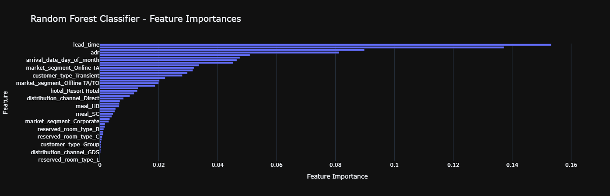

# 🏨 Hotel Booking Cancellation Prediction System 🌟  

<div align="center">
  
  
</div>

---

## 📖 **Overview**  
**❓ Problem Statement**  
Hotels face significant challenges due to last-minute booking cancellations 🚫, leading to revenue loss and inefficient resource management. This system predicts whether a booking will be canceled, empowering hotels to optimize pricing 🏷️, staffing 👥, and inventory 📦.  

**✨ Solution**  
A **machine learning-powered pipeline** that:  
🔹 Processes historical booking data  
🔹 Detects patterns and predicts cancellations  
🔹 Generates actionable insights through easy-to-understand visuals  

---

## 🚀 **Key Features**  
- **Automated Data Pipelines** 📊: From raw data to predictions, fully automated!  
- **Smart Preprocessing** 🧹: Handles missing values, outliers, and data drift.  
- **Model Zoo** 🤖: Trains and compares 5+ ML models (Random Forest, XGBoost, etc.).  
- **Visual Reports** 📈: Interactive charts for decision-makers.  
- **One-Click Deployment** 🚢: Docker and Flask/Streamlit support.  

---

## 🗂️ **Project Structure**  
```plaintext
.
├── 📁 artifacts/              # Auto-generated data & models (not tracked in GitHub)
│   ├── 📁 data/               # Processed datasets
│   └── 📁 objects/            # Saved models & preprocessors
│
├── 📁 notebooks/              # Jupyter notebooks with step-by-step analysis
│   ├── 📁 figures/            # Charts & graphs (like the ones above!)
│   └── 📘 01-fetch_data.ipynb # Data fetching demo
│
├── 📁 src/                    # Core Python code
│   ├── 📁 pipelines/          # Training & prediction workflows
│   └── 📁 model/              # ML model training logic
│
├── 📁 docs/                   # Project documentation
├── 📝 requirements.txt        # Dependencies
└── ⚙️ main.py                # Run the system here!
```

> **Note**: The `artifacts` folder (auto-generated files) is excluded via `.gitignore`.

---

## 🔍 **Exploratory Data Analysis (EDA)**  
We analyzed **100,000+ bookings** to uncover trends:  
- 🗺️ **Guest Origins**: Most guests come from Portugal and Europe.  
  <br>
- 📅 **Booking Patterns**:
    
- 💰 **Pricing Insights**:
    

---

## 🤖 **Model Training & Evaluation**  
### **Performance Highlights**  
| Model           | Accuracy | Precision | Recall |
|-----------------|----------|-----------|--------|
| Random Forest   |   92%    |    89%    |  85%   |
| XGBoost         |   91%    |    88%    |  84%   |

  

### **Why It Works**  
- **Feature Importance**: Lead time, deposit type, and room price are top predictors.  
    

---

## 🛠️ **Getting Started**  
### **Prerequisites**  
- Python 3.8+ 🐍  
- MySQL (for raw data) 🗃️  

### **Installation**  
1. Clone the repo:  
   ```bash
   git clone https://github.com/yourusername/hotel-booking-cancellation.git
   cd hotel-booking-cancellation
   ```
2. Install dependencies:  
   ```bash
   pip install -r requirements.txt
   ```
3. Configure `.env` with your database credentials.  

### **Run the Pipeline**  
```bash
python main.py  # Trains models and generates artifacts!
```

---

## 🧩 **Technologies Used**  
- **Backend**: Python, Scikit-learn, XGBoost  
- **Data Processing**: Pandas, NumPy  
- **Visualization**: Matplotlib, Seaborn  
- **Deployment**: Flask, Docker  

---

## 🌈 **Future Improvements**  
- 🕵️ **Real-Time Monitoring**: Track model performance live.  
- 📱 **Mobile App**: Notify staff about high-risk cancellations.  
- 🌍 **Multi-Hotel Support**: Scale for hotel chains.  

---

## 👥 **Contributors**  
- **Your Name** 👩💻 - [LinkedIn](https://linkedin.com/in/yourprofile) | [Email](mailto:you@example.com)  

**Made with ❤️ for stress-free hotel management!**  

---

<div align="center">
  
</div>